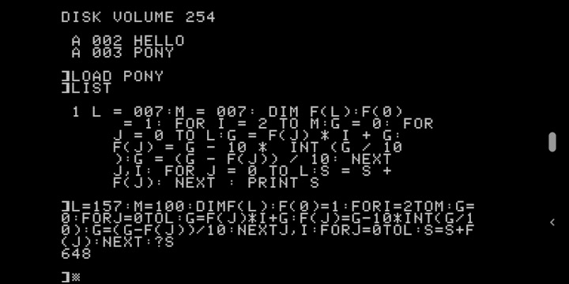

PONY - Reformed Devs Code Golf 2019.06
======================================

Applesoft BASIC, because otherwise it would have been My Little Pony facfic.

The image is a screen shot of an Apple //e emulator running on Android 9 (Pie).
Commands used to demonstrate the program:

 - CATALOG: lists files on the 5.25" diskette
 
 - LOAD PONY: loads the Applesoft BASIC program
 
 - LIST: lists the program, detokenizing and formatting for display. (The values
   with leading zeroes shown in the loaded program were from when I was testing
   and squeezing the code from a few dozen lines down to one.)
 
I retyped the program without the line number or spaces, setting L and M to their
appropriate values for computing 100!. Applesoft allows the use of ? as shorthand
for the PRINT statement when entering code. Since there is no line number, the program
is tokenized and run immediately, printing 648 as the answer to the sum of digits for
100!

Fun fact: Beagle Bros. used to run two-liner contests, a variation of code golf
where the goal was to get as much code packed into a two-line program as possible.
Due to expansion of the code during LISTing to a size exceeding the Apple II line
buffer, editing a line of one these required retyping it.

Emulator used: a2ix by mauiaaron `https://play.google.com/store/apps/details?id=org.deadc0de.apple2ix.basic <https://play.google.com/store/apps/details?id=org.deadc0de.apple2ix.basic>`_

Lee Behrens
